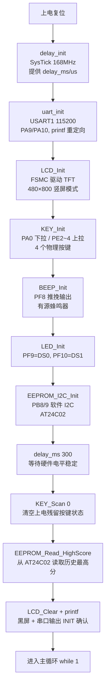
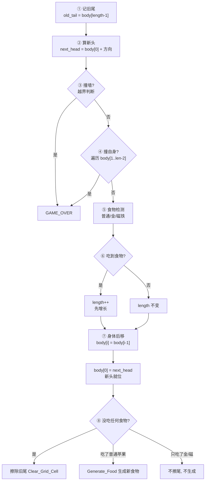
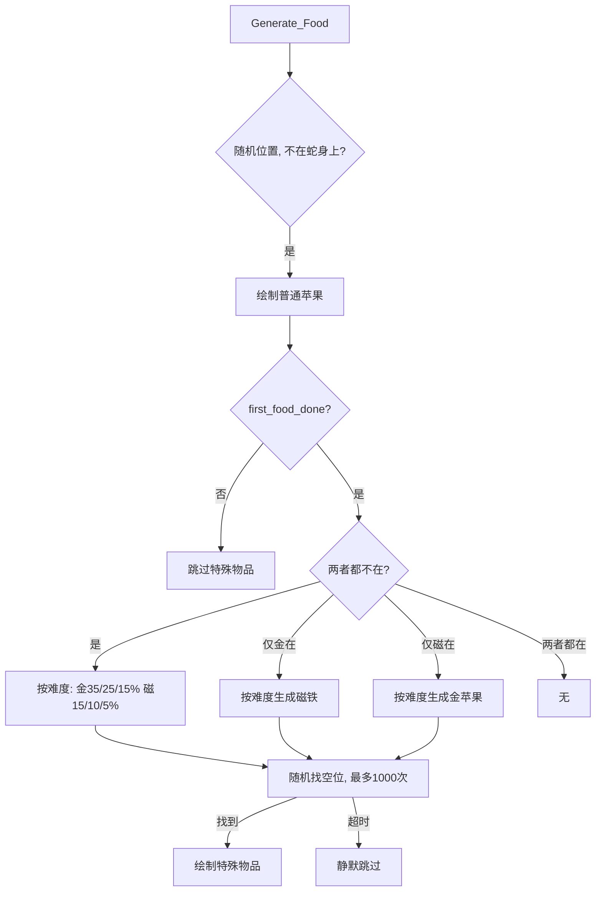
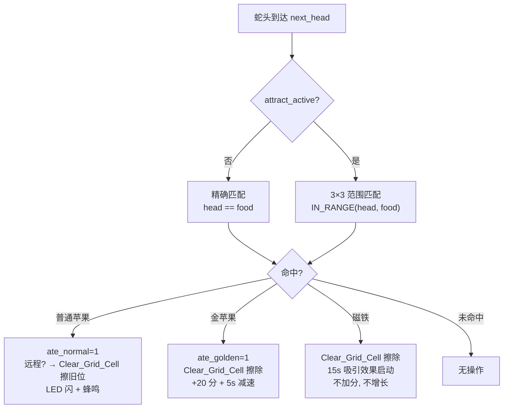
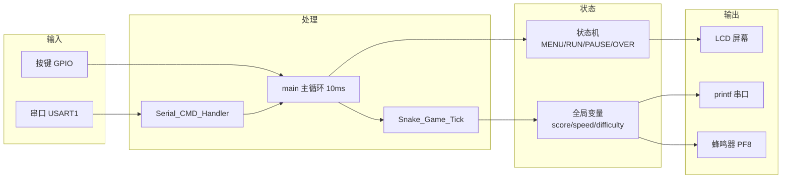

# HOW IT RUNS ― STM32F407 贪吃蛇程序运行全流程

---

## 1. 启动初始化



> 外设就绪后，`current_state = GAME_MENU`，屏幕绘制主菜单。

---

## 2. 主循环 (每 10ms 一圈)

```
while(1):
    delay_ms(10)
    key_val = KEY_Scan(0)        ← 扫描按键
    Serial_CMD_Handler()         ← 处理串口指令
    检测组合键暂停 (KEY2+KEY0)    ← 仅 GAME_RUNNING
    状态切换时绘制界面            ← current_state != last_state
    进入状态机 switch(current_state)
```

---

## 3. 按键扫描

```
KEY_Scan(mode=0):
    优先: KEY0 > KEY1 > KEY2 > WK_UP

    不支持连按 (mode=0):
        按下 → 返回键值 → 标记 key_up=0
        松开后才允许下次触发

    返回: 0=无按键, 1=KEY0, 2=KEY1, 3=KEY2, 4=WK_UP
```

按键引脚：`KEY0=PE4, KEY1=PE3, KEY2=PE2, WK_UP=PA0`

---

## 4. 状态机

详见 [MANUAL.md](MANUAL.md) 状态机章节。

---

## 5. 菜单 (GAME_MENU)

### 界面

```
         SNAKE GAME              (红色大字)
         BEST: 120 / 85 / 30     (黄色各难度最高)

       Select Difficulty:        ← 聚焦时白色，否则灰色
       >  EASY  <                ← 当前选中：绿色高亮
          MEDIUM
          HARD

       ┌──────────────┐
       │    START     │          ← 未选中：空心白框白字
       └──────────────┘           选中：白底黑字

       Menu Controls:
       KEY2/KEY0: Move Focus (Left/Right)
       WK_UP/KEY1: Change Difficulty (Up/Down)
       KEY0 on START: Confirm & Play
```

### 按键逻辑

```
menu_focus: 0=难度选择, 1=START 按钮

KEY0:  menu_focus=0 → 移到 START (menu_focus=1)
       menu_focus=1 → 进入游戏 (GAME_RUNNING)

KEY2:  menu_focus=1 → 移到难度 (menu_focus=0)
       menu_focus=0 → 无反应（左边界）

WK_UP: 仅在 menu_focus=0 → 难度上调 (HARD→MEDIUM→EASY)
KEY1:  仅在 menu_focus=0 → 难度下调 (EASY→MEDIUM→HARD)

边界不循环：EASY 上无反应，HARD 下无反应
```

---

## 6. 游戏运行 (GAME_RUNNING)

### 6.1 游戏区域

```
参数:
    GAME_X_START=24, GAME_Y_START=40   游戏区左上角
    GRID_SIZE=24                       每格像素
    GAME_GRID_NUM_X=18                 水平 18 格 (18×24=432px)
    GAME_GRID_NUM_Y=30                 垂直 30 格 (30×24=720px)

网格坐标 → 屏幕像素:
    sx = GAME_X_START + x × GRID_SIZE
    sy = GAME_Y_START + y × GRID_SIZE

GAME_MENU → GAME_RUNNING:
    LCD_DrawRectangle 画灰色边框 (外扩 1px)
    Snake_Game_Init() 初始化蛇+食物
    timer_count=0, last_score=999, 时间清零
```

### 6.2 蛇的结构与初始化

```c
#define MAX_SNAKE_LEN 100
typedef struct {
    Point body[MAX_SNAKE_LEN]; // body[0]=蛇头, body[1..len-1]=蛇身
    uint16_t length;           // 当前长度
    uint8_t direction;         // 行进方向
} Snake;
Snake mySnake;  // 全局唯一实例
```

```
每段身体存储为网格坐标 (x, y):
    body[0]       = 蛇头坐标
    body[1]       = 第 1 节身体
    body[2]       = 第 2 节身体
    ...
    body[length-1] = 蛇尾坐标

初始化 (length=3, RIGHT):
    蛇头居中 (9, 15), body[1]=(8,15), body[2]=(7,15)
    绘制蛇头(红底+方向眼) + 蛇身(绿底黑边)
    Generate_Food() → 首个普通苹果 (不触发金/磁)
```

### 6.3 蛇移动原理

```
每 tick 身体整体前移一格:

    body[4]=body[3]   ← 尾前移到前一段位置
    body[3]=body[2]
    body[2]=body[1]
    body[1]=body[0]   ← 第 1 节移到旧头位置
    body[0]=next_head ← 新头位置

没吃食物 → 旧尾格 Clear_Grid_Cell 擦除
吃了食物 → length++, 旧尾被移位覆盖, 不擦
```

### 6.4 蛇 Tick 流程



> 每 `current_speed_threshold × 10ms` 执行一次，由 main.c 的 `timer_count` 控制。

### 6.5 增长原理

```
吃之前 (len=4):   H 1 2 3         old_tail = body[3]
吃之后 (len=5):   H 1 2 3 4       先 length=4→5
                  └───────┘        后移：body[4]=body[3]
                  body[3] 覆盖了旧尾位置 → 无需擦除
```

### 6.6 HUD 刷新

```
每吃食物时 (score != last_score):
    Score: 30       ← 白字
    Speed: L5       ← 当前速度等级
    TIME: 01:23     ← 秒级更新
    G               ← 灰=无减速, 金=金苹果减速中
    M               ← 灰=无磁铁吸引, 红=吸引中
```

### 6.7 速度系统

```
level = food_eaten / 3      ← 每 3 苹果升 1 级
threshold = initial - level
speed_level = 1 + level

移动间隔 = threshold × 10ms

        初始     最快    满级需
EASY    220ms   100ms    36 苹果
MEDIUM  160ms    70ms    27 苹果
HARD    100ms    40ms    18 苹果
```

---

## 7. 食物系统

### 7.1 生成逻辑



### 7.2 普通苹果

```
红色 14×14 方块 + 四角抹黑(模拟圆角)
白色 2×4 茎 + 绿色 4×2 叶
每次吃到: +10 分, 蛇 +1 节
```

### 7.3 金色苹果

```
外观同苹果, 红色→金色 (0xFE80)
概率按难度: EASY 35% / MEDIUM 25% / HARD 15%, 至多 1 个
吃到: +20 分, 5 秒减速 (threshold+5 上限初始值)
减速期间蛇头变为金色
```

### 7.4 磁铁

```
红蓝双色 U 型, 白色金属帽
概率按难度: EASY 15% / MEDIUM 10% / HARD 5%, 至多 1 个, 与金苹果可共存
吃到: 不加分, 不增蛇身, 15 秒吸引效果
吸引: 蛇头 3×3 范围内自动吃食物
```

### 7.5 碰撞检测

蛇头 (`next_head`) 与食物的判定分两种模式：

**普通模式** (attract_active = 0)：蛇头坐标 **精确等于** 食物坐标。

**吸引模式** (attract_active = 1)：蛇头在食物 **3×3 范围内** 即命中。

```
IN_RANGE = |head.x - food.x| ≤ 1 且 |head.y - food.y| ≤ 1
```



> **远程擦除**：吸引模式下蛇头不在食物格 → 食物不会像精确碰撞那样被蛇头覆盖 → 必须显式 `Clear_Grid_Cell`。

> **三种食物检测独立**：同一个 tick 可同时命中普通+金+磁铁（均在 3×3 范围内），各自独立处理。

---

## 8. 暂停 (GAME_PAUSED)

```
触发: 游戏中 KEY2 + KEY0 同时按下
界面: 半透明悬浮窗 + 操作提示
操作: WK_UP 继续 / KEY1 退出
```

---

## 9. 结算 (GAME_OVER)

```
触发: 撞墙 或 撞自身 → Play_Death_Alert (LED+蜂鸣器 4 次爆闪)

界面: GAME OVER 红字 + Score + TIME
      若破纪录: NEW RECORD + 蜂鸣器三连响 + EEPROM 自动保存

操作: KEY0 → 回到菜单
```

---

## 10. 串口通信

### 10.1 自动输出

```
启动:   [INIT] Snake game ready
吃食物: [SCORE] 30 pts | Speed L5 (threshold=18)
死亡:   [DEAD] Hit wall at (18, 5)
        [DEAD] Self-collision at (7, 12)
食物:   [FOOD] Generated at (3, 8)
金苹果: [GOLD] Generated / Eaten
磁铁:   [MAGNET] Generated / Eaten
```

### 10.2 接收指令

```
USART1 中断 → USART_RX_BUF → 主循环 Serial_CMD_Handler()

指令 (仅小写, 支持带/不带 \r\n):
    beep on/off        蜂鸣器开关
    diff easy/medium/hard  难度切换 (仅菜单)

超时: 100ms 无新数据自动按完整指令处理
```

---

## 11. 蜂鸣器静音

```
beep_enable (默认 0):
    0 → BEEP_ON() 为空操作, 所有声音静音
    1 → 正常发声

可通过串口 beep on/off 实时切换
```

---

## 12. EEPROM 最高分

```
AT24C02, 软件 I2C (PB8/PB9)
按难度分别存储, addr = offset × 2:
  EASY:   地址 56-57 (offset 28)
  MEDIUM: 地址 58-59 (offset 29)
  HARD:   地址 60-61 (offset 30)

读取: 启动时 EEPROM_Read_HighScore(28/29/30)
      空白芯片 (0xFFFF) → 返回 0

保存: 破纪录时 EEPROM_Write_HighScore(offset, score)
      按当前难度写入对应槽位
```

---

## 13. 完整数据流


