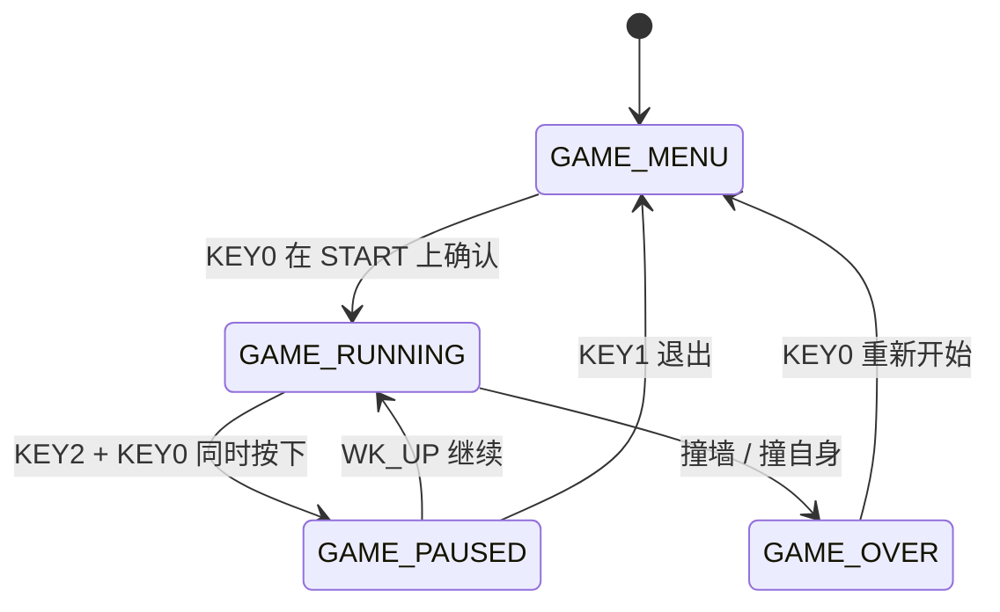

# 操作手册

---

## 状态机

---

## 菜单操作

| 按键 | 功能 |
|------|------|
| `KEY2` / `KEY0` | 左右移动焦点（难度选择 ? START 按钮） |
| `WK_UP` / `KEY1` | 仅在难度聚焦时：上/下调整难度（带边界，不循环） |
| `KEY0`（在 START 上） | 确认进入游戏 |

难度聚焦时 LCD 高亮显示 `Select Difficulty:`，选中 START 时按钮变为白底黑字实心。

### 难度

| 难度 | 初始速度 | 加速规则 | 最快 | 满级需 |
|------|:---:|------|:---:|:---:|
| EASY | 220ms | 每 3 苹果升 1 级 | 100ms (L13) | 36 苹果 |
| MEDIUM | 160ms | 每 3 苹果升 1 级 | 70ms (L10) | 27 苹果 |
| HARD | 100ms | 每 3 苹果升 1 级 | 40ms (L7) | 18 苹果 |

> 公式：`threshold = 初始 ? level`，`speed_level = 1 + level`，`level = food_eaten / 3`。

---

## 游戏操作

| 按键 | 方向 |
|------|:---:|
| WK_UP | 上 |
| KEY2 | 左 |
| KEY1 | 下 |
| KEY0 | 右 |
| KEY2 + KEY0 同时 | 暂停 |

### HUD

首页显示：BEST: EASY / MEDIUM / HARD（自然宽度）
屏幕顶部显示：Score / Speed Lx / TIME MM:SS / G（金苹果状态） / M（磁铁状态）

### 金色食物

- 概率与普通苹果同时出现（至多 1 个，游戏开始时的首个食物不触发）：EASY 35% / MEDIUM 25% / HARD 15%
- 吃到后 +20 分（2 倍），并触发 5 秒减速效果
- 减速期间蛇头变为金色、速度阈值 +5（不超过该难度初始值：EASY 22 / MEDIUM 16 / HARD 10）

### 磁铁

- 概率与普通苹果同时出现（至多 1 个，与金苹果生成时互斥）：EASY 15% / MEDIUM 10% / HARD 5%
- 吃到后触发 15 秒**吸引效果**：蛇头可吃到周围 8 格内的食物（3×3 排除正前方一格，正前方留给蛇自然行进到达，金苹果、磁铁均有效）
- 磁铁本身不加分、不增长蛇身
- HUD 灰色 `G` 表示无减速，金色 `G` 表示金苹果减速生效中；灰色 `M` 表示无吸引效果，红色 `M` 表示吸引生效中

### 长按加速

- **触发**：按住当前方向键 **200ms 以上**（不含方向切换时的短按）
- **效果**：移动间隔缩短至 **30ms/帧**（约 33 fps），不受难度速度影响
- **结束**：松手即恢复为当前难度正常速度
- **防误触**：每次方向改变后进入 **200ms 冷却窗口**，冷却期间即使按住同向键也不加速。短按转向（<200ms）因此不会触发加速

---

## 暂停

- **触发**：游戏中 `KEY2 + KEY0` 同时按下
- **继续**：按 `WK_UP`
- **退出**：按 `KEY1` 返回菜单

---

## 串口调试

USART1 115200 连接串口调试助手。

### 自动输出

| 事件 | 格式 |
|------|------|
| 启动 | `[INIT] Snake game ready` |
| 吃食物 | `[SCORE] N pts \| Speed Lx (threshold=N)` |
| 死亡 | `[DEAD] Hit wall at (x, y)` 或 `Self-collision at (x, y)` |
| 新食物 | `[FOOD] Generated at (x, y)` |
| 金色食物生成 | `[GOLD] Generated at (x, y)` |
| 吃到金色食物 | `[GOLD] Eaten! +20 pts, speed slowed 5s` |
| 磁铁生成 | `[MAGNET] Generated at (x, y)` |
| 吃到磁铁 | `[MAGNET] Eaten! Attraction active 15s` |

### 指令（仅小写）

| 指令 | 功能 | 限制 |
|------|------|------|
| `beep on` / `beep off` | 蜂鸣器开关 | 无 |
| `diff easy` / `medium` / `hard` | 切换难度 | 仅菜单中生效 |

每条指令均回复 `[CMD] ...` 确认。蜂鸣器默认静音（`beep_enable = 0`）。

---

## 注意事项

- 4.3/7 寸屏需外部 12V 1A 供电
- 串口必须初始化，否则 LCD 及 printf 无法工作
