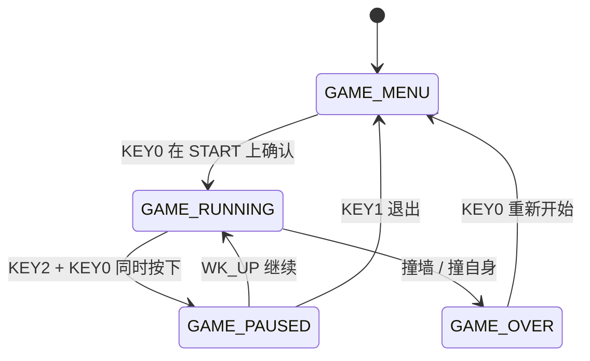

# STM32F407 贪吃蛇游戏

基于正点原子探索者 STM32F4 开发板的贪吃蛇游戏。

---

## 硬件

| 组件 | 说明 |
|------|------|
| MCU | STM32F407ZGT6, 168MHz |
| 屏幕 | TFT-LCD 480x800 竖屏, FSMC 驱动 |
| 按键 | WK_UP(PA0), KEY2(PE2), KEY1(PE3), KEY0(PE4) |
| 蜂鸣器 | PF8, 支持静音开关 |
| LED | DS0(PF9), DS1(PF10) |
| 串口 | USART1, 115200, PA9/PA10 (CH340) |
| EEPROM | I2C, 掉电保存最高分 |

---

## 状态机

---

## 菜单操作

| 按键 | 功能 |
|------|------|
| `KEY2` / `KEY0` | 左右移动焦点（难度选择 ? START 按钮） |
| `WK_UP` / `KEY1` | 仅在难度聚焦时：上/下调整难度（带边界，不循环） |
| `KEY0`（在 START 上） | 确认进入游戏 |

难度聚焦时 LCD 高亮显示 `Select Difficulty:`，选中 START 时按钮变为白底黑字实心。

### 难度

| 难度 | 初始速度 | 加速规则 | 下限 |
|------|:---:|------|:---:|
| EASY | 25 | 每吃 2 个食物 -1 | 10 |
| MEDIUM | 18 | 每吃 1 个食物 -1 | 5 |
| HARD | 11 | 每吃 1 个食物 -1 | 3 |

---

## 游戏操作

| 按键 | 方向 |
|------|:---:|
| WK_UP | 上 |
| KEY2 | 左 |
| KEY1 | 下 |
| KEY0 | 右 |
| KEY2 + KEY0 同时 | 暂停 |

### HUD

屏幕顶部显示：Score / Speed Lx / TIME MM:SS

### 金色食物

- 35% 概率与普通苹果同时出现（至多 1 个）
- 吃到后 +20 分（2 倍），并触发 5 秒减速效果
- 减速期间速度阈值 +5（不超过该难度初始速度）
- 外观为金色苹果

---

## 串口调试

USART1 115200 连接串口调试助手。

### 自动输出

| 事件 | 格式 |
|------|------|
| 启动 | `[INIT] Snake game ready` |
| 吃食物 | `[SCORE] N pts \| Speed Lx (threshold=N)` |
| 死亡 | `[DEAD] Hit wall at (x, y)` 或 `Self-collision at (x, y)` |
| 新食物 | `[FOOD] Generated at (x, y)` |
| 金色食物生成 | `[GOLD] Generated at (x, y)` |
| 吃到金色食物 | `[GOLD] Eaten! +20 pts, speed slowed 5s` |

### 指令（仅小写）

| 指令 | 功能 | 限制 |
|------|------|------|
| `beep on` / `beep off` | 蜂鸣器开关 | 无 |
| `diff easy` / `medium` / `hard` | 切换难度 | 仅菜单中生效 |

每条指令均回复 `[CMD] ...` 确认。蜂鸣器默认静音（`beep_enable = 0`）。

---

## 注意事项

- 4.3/7 寸屏需外部 12V 1A 供电
- 串口必须初始化，否则 LCD 及 printf 无法工作

---

*正点原子 @ ALIENTEK*
